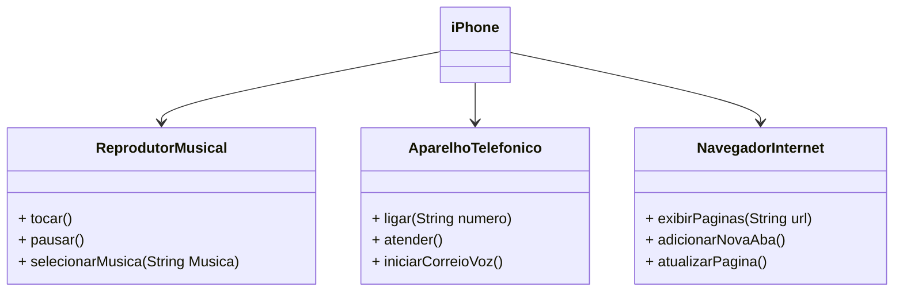

# Santander-Bootcamp-Uml-2024

## Modelagem e Diagramação de um Componente iPhone

### Descrição
Este projeto foi desenvolvido com o objetivo de praticar e aprimorar a utilização de classes e interfaces na linguagem de programação Java. Ele abrange conceitos fundamentais de Programação Orientada a Objetos (POO) e é ideal para quem deseja solidificar seus conhecimentos em Java através da implementação de estruturas de código robustas e bem-organizadas.

## Funcionalidades
* Definição e Implementação de Classes: Criação de diversas classes para representar diferentes entidades e suas respectivas funcionalidades.
* Uso de Interfaces: Implementação de interfaces para estabelecer contratos de comportamento entre classes.

### Diagrama UML

Você pode visualizar o modelo acima [clicando aqui](https://lucid.app/lucidchart/aa690aae-0dc7-4463-8654-34a70409c8f6/edit?view_items=U_Epn0PlUUul%2CBAkRWx8A9CWo%2CIAkRhA6JUv6u&invitationId=inv_594f704b-6570-473b-a8c2-a770795cebc7) .
